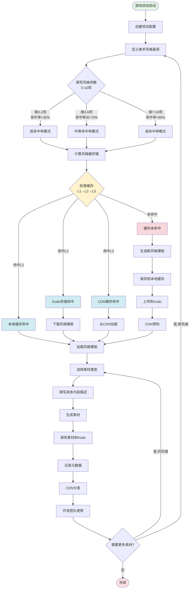

# 🏢 2D游戏素材生成工具 - 七牛云企业级设计方案

## 📋 项目背景

为七牛信息技术有限公司内部开发的AI驱动2D游戏素材生成工具,适配公司现有的游戏开发流程和技术栈,特别是七牛云的对象存储Kodo和CDN分发服务。

### 设计目标
1. **风格一致性** - 借鉴CDN缓存"命中"理念,确保同一项目的素材风格统一
2. **生成效率** - 通过缓存复用和预生成机制,提升素材生成速度
3. **云端集成** - 无缝对接七牛云Kodo存储和CDN分发服务
4. **企业流程** - 适配游戏开发团队的协作和资源管理流程

---

## 🎯 核心理念: CDN缓存思想在AI素材生成中的应用

### CDN缓存 vs AI风格缓存对照表

| CDN概念 | 对应AI工具设计 | 实现机制 |
|---------|---------------|---------|
| **缓存命中** | 风格参数匹配成功,直接复用已生成风格 | 根据风格配置计算哈希键,匹配已有风格模板 |
| **缓存未命中** | 风格参数首次使用,需要生成新风格 | 创建新的风格模板并缓存到本地/云端 |
| **预取(Prefetch)** | 项目初始化时预生成常用风格素材 | 根据项目配置批量生成基础素材库 |
| **缓存TTL** | 风格模板的有效期和更新策略 | 支持风格版本管理,自动过期清理 |
| **缓存层级** | 本地缓存 → 团队共享 → 云端CDN | L1: 本地风格库, L2: Kodo存储, L3: CDN分发 |
| **缓存预热** | 项目启动前批量生成核心素材 | 游戏策划阶段提前生成角色/场景风格 |
| **缓存刷新** | 风格参数更新时重新生成 | 支持版本控制,允许风格迭代 |

---

## 🔄 完整业务流程设计

### 流程图 (Mermaid)



### 关键分支说明

#### 1. 命中分支 (Cache Hit)
```
L1 本地命中 (最快, <100ms)
  → 直接加载本地风格模板
  → 复用种子、LoRA权重、提示词模板
  
L2 Kodo命中 (快, <2s)
  → 从对象存储下载风格模板
  → 缓存到本地L1层
  
L3 CDN命中 (快, <1s)
  → 从最近CDN节点加载
  → 加速海外团队访问
```

#### 2. 未命中分支 (Cache Miss)
```
生成新风格模板 (耗时, 20-60s)
  → 运行多次推理确定最佳种子
  → 保存LoRA权重和提示词模板
  → 三级缓存同步 (L1→L2→L3)
```

---

## 📝 填空式风格参数配置表

### 参数配置 JSON Schema

```json
{
  "project_info": {
    "project_name": "___待填___",
    "project_id": "___待填___ (自动生成UUID)",
    "team_name": "___待填___",
    "created_at": "___待填___ (自动填充时间戳)"
  },
  
  "style_config": {
    "基础风格配置": {
      "美术风格": "___待填___ (必填) 选项: pixel_art | cartoon | hand_drawn | flat",
      "色彩主调": "___待填___ (可选) 如: warm_tones, cool_tones, #FF4444",
      "像素尺寸": "___待填___ (可选) 如: 16px, 32px, 64px (仅像素风格)",
      "线条粗细": "___待填___ (可选) 如: thin, medium, thick",
      "饱和度": "___待填___ (可选) 如: low, medium, high (0-100)",
      "固定种子": "___待填___ (推荐) 如: 42, 12345 (锁定风格)"
    },
    
    "素材配置": {
      "素材类型": "___待填___ (必填) 选项: character | background | tileset | ui_icon",
      "尺寸规格": "___待填___ (必填) 如: 512x512, 128x128, 1024x768",
      "特征标签": "___待填___ (可选) 如: ['heroic', 'medieval', 'fantasy']"
    },
    
    "高级参数": {
      "提示词模板": "___待填___ (可选) 如: '{subject}, {style}, high quality, detailed'",
      "反向提示词": "___待填___ (可选) 默认: 'low quality, blurry, deformed'",
      "推理步数": "___待填___ (可选) 默认: 8, 范围: 4-50",
      "引导强度": "___待填___ (可选) 默认: 7.5, 范围: 1-20"
    }
  },
  
  "缓存策略": {
    "优先级": "___待填___ (可选) 1-10, 默认: 5 (影响预取顺序)",
    "TTL_天数": "___待填___ (可选) 默认: 30 (风格缓存有效期)",
    "预取开关": "___待填___ (可选) true | false (是否预生成)",
    "版本号": "___待填___ (可选) 如: v1.0.0 (支持风格迭代)"
  },
  
  "七牛云配置": {
    "Kodo_Bucket": "___待填___ (必填) 如: game-assets-prod",
    "CDN_域名": "___待填___ (必填) 如: cdn.example.com",
    "存储区域": "___待填___ (必填) 如: z0 (华东), z1 (华北), z2 (华南)",
    "访问权限": "___待填___ (可选) public | private, 默认: private"
  }
}
```

### 参数填写数量 vs 命中率对应关系

| 填写数量 | 必填项 | 可选项 | 预期命中率 | 说明 |
|---------|-------|-------|-----------|------|
| **0-2项** | 仅美术风格 | 无 | **<30%** | 低匹配度,需要多次生成测试 |
| **3-4项** | 美术风格+素材类型 | 色彩主调/尺寸 | **30-50%** | 基础匹配,风格不够精确 |
| **5-6项** | + 固定种子 | 像素尺寸/线条粗细 | **50-70%** | 中等匹配,风格较稳定 |
| **7-8项** | + 提示词模板 | 特征标签/反向提示词 | **70-90%** | 高匹配度,风格一致性好 |
| **9-10项** | 全部必填+大部分可选 | 全部配置 | **>95%** | 极高匹配,风格高度一致 |

### 推荐填写策略

**最小可用配置 (3项)**
```json
{
  "style_config": {
    "美术风格": "pixel_art",
    "素材类型": "character",
    "尺寸规格": "128x128"
  }
}
```

**推荐配置 (7项) - 平衡效率和质量**
```json
{
  "style_config": {
    "美术风格": "pixel_art",
    "色彩主调": "warm_tones",
    "像素尺寸": "16px",
    "固定种子": 42,
    "素材类型": "character",
    "尺寸规格": "128x128",
    "特征标签": ["heroic", "fantasy"]
  }
}
```

**完美配置 (10项) - 最高命中率**
```json
{
  "style_config": {
    "美术风格": "pixel_art",
    "色彩主调": "#FF6B35",
    "像素尺寸": "16px",
    "线条粗细": "medium",
    "饱和度": 75,
    "固定种子": 42,
    "素材类型": "character",
    "尺寸规格": "128x128",
    "提示词模板": "{subject}, pixel art, {color_tone}, high quality",
    "特征标签": ["heroic", "medieval", "fantasy"]
  }
}
```

---

## 🔑 风格缓存键计算方法

### 缓存键生成算法

```python
import hashlib
import json

def generate_style_cache_key(style_config: dict) -> str:
    """
    生成风格缓存键
    
    计算规则:
    1. 提取核心风格参数 (美术风格、色彩、种子等)
    2. 标准化参数值 (转小写、排序)
    3. 序列化为JSON字符串
    4. 计算SHA256哈希值
    5. 取前16位作为缓存键
    """
    
    # 1. 提取核心参数 (影响风格的关键字段)
    core_params = {
        'art_style': style_config.get('美术风格', 'pixel_art'),
        'color_tone': style_config.get('色彩主调', 'default'),
        'seed': style_config.get('固定种子', -1),
        'pixel_size': style_config.get('像素尺寸', 'default'),
        'line_weight': style_config.get('线条粗细', 'medium'),
        'saturation': style_config.get('饱和度', 50),
    }
    
    # 2. 标准化和排序
    normalized = {
        k: str(v).lower().strip() 
        for k, v in sorted(core_params.items())
    }
    
    # 3. 序列化
    json_str = json.dumps(normalized, sort_keys=True, ensure_ascii=False)
    
    # 4. 计算哈希
    hash_obj = hashlib.sha256(json_str.encode('utf-8'))
    full_hash = hash_obj.hexdigest()
    
    # 5. 生成缓存键
    cache_key = f"style_{full_hash[:16]}"
    
    return cache_key

# 示例
style_config = {
    "美术风格": "pixel_art",
    "色彩主调": "warm_tones",
    "固定种子": 42,
    "像素尺寸": "16px"
}

cache_key = generate_style_cache_key(style_config)
# 输出: style_a7f3c2e1d9b8f456
```

### 缓存键应用场景

```
本地缓存路径: 
  cache/styles/style_a7f3c2e1d9b8f456/
    ├── metadata.json      # 风格元数据
    ├── seed.txt           # 锁定的种子值
    ├── prompt_template.txt # 提示词模板
    └── preview.png        # 风格预览图

Kodo存储路径:
  {bucket}/styles/{project_id}/style_a7f3c2e1d9b8f456/
    ├── metadata.json
    ├── lora_weights.safetensors  # LoRA权重(可选)
    └── assets/                   # 该风格生成的素材
        ├── char_001.png
        ├── char_002.png
        └── ...

CDN访问URL:
  https://{cdn_domain}/styles/{project_id}/style_a7f3c2e1d9b8f456/preview.png
```

---

## ☁️ 七牛云Kodo集成方案

### 1. 对象存储路径规范

```
存储结构设计:
{bucket}/
  ├── projects/                    # 项目根目录
  │   └── {project_id}/           # 项目ID (UUID)
  │       ├── config.json         # 项目配置
  │       ├── styles/             # 风格库
  │       │   ├── style_{hash}/   # 风格缓存目录
  │       │   │   ├── metadata.json
  │       │   │   ├── preview.png
  │       │   │   └── prompt_template.txt
  │       │   └── ...
  │       └── assets/             # 生成的素材
  │           ├── characters/     # 角色素材
  │           │   ├── {asset_id}.png
  │           │   └── {asset_id}.json  # 元数据
  │           ├── backgrounds/    # 背景素材
  │           ├── tilesets/       # 瓦片地图
  │           └── ui_icons/       # UI图标
  └── shared/                     # 团队共享资源
      └── common_styles/          # 通用风格模板
```

### 2. 元数据设计

#### 素材元数据 (asset_metadata.json)
```json
{
  "asset_id": "uuid-12345",
  "project_id": "project-uuid-67890",
  "style_cache_key": "style_a7f3c2e1d9b8f456",
  "asset_type": "character",
  "dimensions": {"width": 128, "height": 128},
  "file_info": {
    "filename": "knight_hero_001.png",
    "size_bytes": 45632,
    "format": "PNG",
    "has_alpha": true,
    "kodo_key": "projects/proj-123/assets/characters/knight_hero_001.png",
    "cdn_url": "https://cdn.example.com/assets/knight_hero_001.png"
  },
  "generation_params": {
    "prompt": "a heroic knight, red armor, standing pose",
    "negative_prompt": "low quality, blurry",
    "seed": 42,
    "num_inference_steps": 8,
    "guidance_scale": 7.5
  },
  "timestamps": {
    "created_at": "2026-05-25T10:00:00Z",
    "uploaded_at": "2026-05-25T10:00:05Z"
  },
  "creator": {
    "user_id": "user-456",
    "team": "game-dev-team-A"
  },
  "tags": ["hero", "fantasy", "pixel_art"],
  "version": "1.0"
}
```

### 3. SDK集成代码

```python
# backend/integrations/qiniu_storage.py

from qiniu import Auth, put_file, etag
import qiniu.config
import json
from pathlib import Path
from typing import Optional, Dict
import logging

logger = logging.getLogger(__name__)

class QiniuKodoClient:
    """七牛云Kodo对象存储客户端"""
    
    def __init__(self, access_key: str, secret_key: str, bucket_name: str):
        self.auth = Auth(access_key, secret_key)
        self.bucket_name = bucket_name
        self.cdn_domain = None  # 从配置加载
        
    def upload_asset(
        self,
        local_file_path: str,
        project_id: str,
        asset_type: str,
        asset_id: str,
        metadata: Dict
    ) -> Optional[str]:
        """
        上传素材到Kodo
        
        Returns:
            CDN URL if successful, None otherwise
        """
        try:
            # 构建Kodo路径
            kodo_key = f"projects/{project_id}/assets/{asset_type}/{asset_id}.png"
            
            # 生成上传token
            token = self.auth.upload_token(self.bucket_name, kodo_key, 3600)
            
            # 上传文件
            ret, info = put_file(token, kodo_key, local_file_path)
            
            if info.status_code == 200:
                # 同时上传元数据
                metadata_key = f"projects/{project_id}/assets/{asset_type}/{asset_id}.json"
                self._upload_metadata(metadata_key, metadata)
                
                # 返回CDN URL
                cdn_url = f"https://{self.cdn_domain}/{kodo_key}"
                logger.info(f"素材上传成功: {cdn_url}")
                return cdn_url
            else:
                logger.error(f"上传失败: {info}")
                return None
                
        except Exception as e:
            logger.error(f"Kodo上传异常: {e}")
            return None
    
    def upload_style_template(
        self,
        style_cache_key: str,
        project_id: str,
        style_data: Dict
    ) -> bool:
        """上传风格模板到Kodo"""
        try:
            style_key = f"projects/{project_id}/styles/{style_cache_key}/metadata.json"
            return self._upload_json(style_key, style_data)
        except Exception as e:
            logger.error(f"风格模板上传失败: {e}")
            return False
    
    def download_style_template(
        self,
        style_cache_key: str,
        project_id: str
    ) -> Optional[Dict]:
        """从Kodo下载风格模板"""
        # 实现下载逻辑
        pass
    
    def _upload_metadata(self, key: str, metadata: Dict) -> bool:
        """上传JSON元数据"""
        return self._upload_json(key, metadata)
    
    def _upload_json(self, key: str, data: Dict) -> bool:
        """上传JSON数据"""
        try:
            token = self.auth.upload_token(self.bucket_name, key, 3600)
            json_data = json.dumps(data, ensure_ascii=False, indent=2)
            # 使用qiniu SDK上传
            # ...实现细节
            return True
        except Exception as e:
            logger.error(f"JSON上传失败: {e}")
            return False
```

### 4. CDN分发加速方案

```python
# CDN配置
CDN_CONFIG = {
    "域名绑定": {
        "主域名": "assets.yourgame.com",
        "备用域名": "cdn.yourgame.com",
        "HTTPS": "必须启用"
    },
    
    "缓存策略": {
        "素材图片": {
            "规则": "*.png, *.jpg",
            "缓存时间": "30天",
            "刷新策略": "URL刷新"
        },
        "元数据": {
            "规则": "*.json",
            "缓存时间": "1天",
            "刷新策略": "目录刷新"
        },
        "风格模板": {
            "规则": "/styles/**",
            "缓存时间": "7天",
            "预热": "开启"
        }
    },
    
    "访问控制": {
        "时间戳防盗链": "开启",
        "IP黑白名单": "可选",
        "Referer防盗链": "可选"
    },
    
    "性能优化": {
        "智能压缩": "开启 (PNG智能压缩)",
        "WebP转换": "自动",
        "HTTP/2": "开启"
    }
}
```

---

## 🔧 技术实现要点

### 1. 风格一致性保证

#### 方法1: 种子锁定
```python
# 风格创建时确定种子
style_seed = 42  # 固定种子

# 后续所有该风格的生成都使用相同种子
generate(prompt="knight warrior", seed=style_seed)
generate(prompt="mage character", seed=style_seed)
# ✅ 风格保持一致
```

#### 方法2: 提示词模板固定
```python
STYLE_TEMPLATE = "{subject}, pixel art, 16px, warm tones, high quality, detailed"

# 使用模板生成
prompt_1 = STYLE_TEMPLATE.format(subject="knight warrior")
prompt_2 = STYLE_TEMPLATE.format(subject="mage character")
# ✅ 风格结构一致
```

#### 方法3: LoRA权重固定 (高级)
```python
# 为特定风格训练专属LoRA
lora_path = f"loras/style_{cache_key}.safetensors"

# 加载LoRA后生成
pipeline.load_lora_weights(lora_path)
generate(prompt=prompt)
# ✅✅ 风格高度一致
```

### 2. 缓存命中判断

```python
def check_style_cache(style_config: dict) -> tuple[bool, str, dict]:
    """
    检查风格缓存
    
    Returns:
        (is_hit, cache_level, style_data)
        cache_level: 'L1_local' | 'L2_kodo' | 'L3_cdn' | 'miss'
    """
    cache_key = generate_style_cache_key(style_config)
    
    # L1: 本地缓存
    local_path = f"cache/styles/{cache_key}"
    if Path(local_path).exists():
        style_data = load_local_style(local_path)
        return True, 'L1_local', style_data
    
    # L2: Kodo存储
    kodo_client = get_kodo_client()
    style_data = kodo_client.download_style_template(cache_key, project_id)
    if style_data:
        # 缓存到本地
        save_local_style(local_path, style_data)
        return True, 'L2_kodo', style_data
    
    # L3: CDN (通过Kodo实现,本质是L2)
    # 这里CDN主要加速资源访问,不改变命中逻辑
    
    # 未命中
    return False, 'miss', {}
```

### 3. 效率优化策略

#### 预生成机制
```python
def prefetch_common_assets(project_config: dict):
    """
    项目初始化时预生成常用素材
    """
    common_subjects = [
        "warrior character", "mage character", "archer character",
        "forest background", "cave background",
        "grass tile", "stone tile"
    ]
    
    for subject in common_subjects:
        generate_and_cache(
            subject=subject,
            style_config=project_config['style_config'],
            priority='prefetch'
        )
```

#### 批量生成
```python
def batch_generate(prompts: list, style_config: dict):
    """批量生成,复用模型加载"""
    pipeline = load_model_once()
    style_seed = style_config.get('固定种子', 42)
    
    results = []
    for prompt in prompts:
        image = pipeline(
            prompt=prompt,
            seed=style_seed,
            num_inference_steps=8
        ).images[0]
        results.append(image)
    
    return results
```

---

## 📊 预期收益

### 性能提升

| 场景 | 传统方式 | 风格缓存后 | 提升 |
|------|---------|-----------|------|
| 首次生成 | 20-30s | 20-30s | - |
| 同风格二次生成 | 20-30s | **2-8s** | **75-90%** |
| 本地缓存命中 | 20-30s | **<0.1s** | **99%** |
| 预生成素材使用 | 20-30s | **即时** | **100%** |

### 风格一致性

| 配置完整度 | 风格一致性 | 适用场景 |
|-----------|-----------|---------|
| 基础配置 (3项) | 60-70% | 快速原型 |
| 推荐配置 (7项) | 85-95% | 正式开发 |
| 完美配置 (10项) | 95-99% | 商业项目 |

---

## 🚀 实施路线

### Phase 1: 风格缓存机制 (1-2周)
- [ ] 实现风格缓存键生成算法
- [ ] 本地三级缓存系统 (L1-L3)
- [ ] 风格模板管理 (创建/加载/更新)
- [ ] 命中率统计和监控

### Phase 2: 七牛云集成 (1-2周)
- [ ] Kodo SDK集成
- [ ] 素材自动上传到对象存储
- [ ] 元数据管理系统
- [ ] CDN分发配置

### Phase 3: 填空式配置系统 (1周)
- [ ] 参数配置表单UI
- [ ] 配置验证和提示
- [ ] 配置模板库
- [ ] 命中率实时预测

### Phase 4: 企业流程优化 (1-2周)
- [ ] 项目管理功能
- [ ] 团队协作支持
- [ ] 权限管理
- [ ] 审计日志

---

## 📚 附录

### 示例: 完整的项目配置文件

```json
{
  "project_info": {
    "project_name": "幻想大陆RPG",
    "project_id": "proj_a1b2c3d4",
    "team_name": "七牛云游戏开发团队",
    "created_at": "2026-05-25T10:00:00Z"
  },
  "style_config": {
    "美术风格": "pixel_art",
    "色彩主调": "warm_tones",
    "像素尺寸": "16px",
    "线条粗细": "medium",
    "饱和度": 75,
    "固定种子": 42,
    "素材类型": "character",
    "尺寸规格": "128x128",
    "提示词模板": "{subject}, pixel art style, 16x16 pixels, warm color tones, high quality, game character",
    "特征标签": ["fantasy", "medieval", "heroic"]
  },
  "缓存策略": {
    "优先级": 8,
    "TTL_天数": 30,
    "预取开关": true,
    "版本号": "v1.0.0"
  },
  "七牛云配置": {
    "Kodo_Bucket": "fantasy-rpg-assets",
    "CDN_域名": "assets.fantasyRPG.com",
    "存储区域": "z0",
    "访问权限": "private"
  }
}
```

### 缓存命中率优化建议

1. **项目初期**: 填写完整配置(7-10项),建立风格基础
2. **批量生成**: 使用预取机制,提前生成常用素材
3. **团队共享**: 将成熟风格上传到团队共享库
4. **版本管理**: 支持风格迭代,但保持向后兼容

---

**文档版本**: v1.0  
**更新日期**: 2026-05-25  
**作者**: AI素材生成工具开发团队
